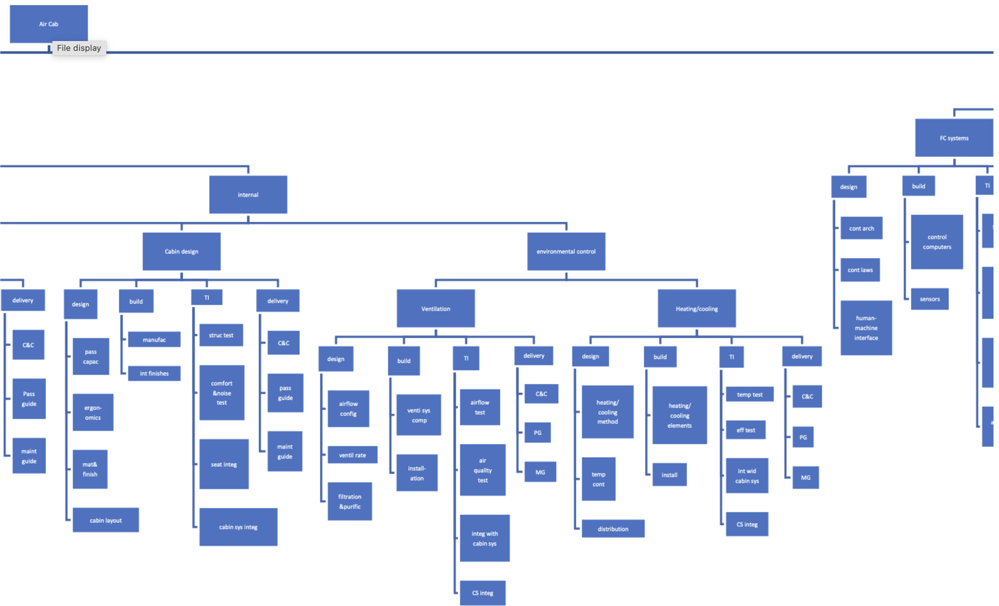
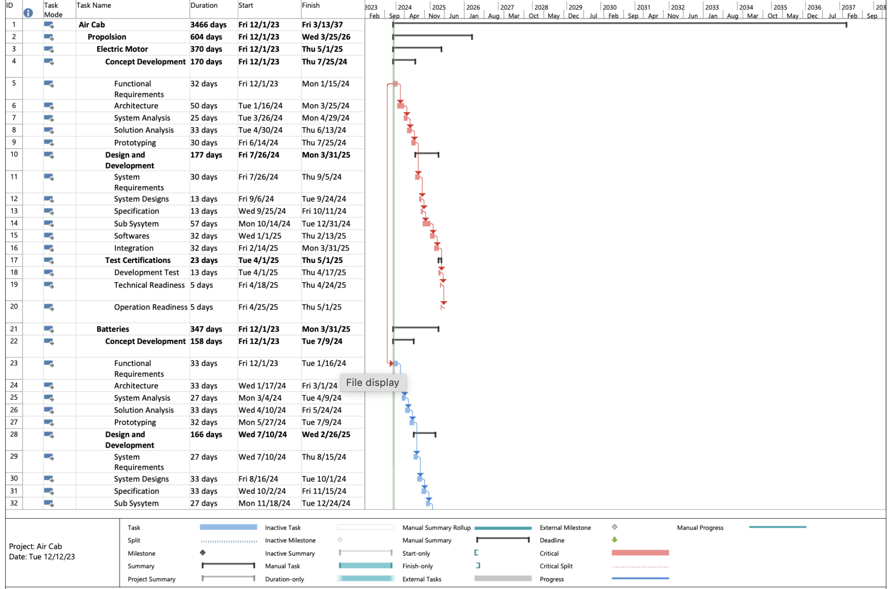

# Project Management for AirCab – eVTOL Technology Development

This repository showcases the complete lifecycle project management of **AirCab**, an Electric Vertical Take-Off and Landing (eVTOL) aircraft developed for Uber under AlphaTech Pvt. Ltd. The initiative spans the full systems engineering process—from concept development through to certification—addressing the multifaceted technical, regulatory, and financial challenges associated with urban air mobility.

---

## ✈️ Project Overview

- **Client:** Uber  
- **Objective:** Design and deliver a production-ready eVTOL aircraft (100 units)  
- **Timeline:** 2023–2037 (3466 days)  
- **Frameworks & Standards:** ISO 19115, ISO 9241-210, ISO 19600, ISO 10004

---

## 🔧 Technical Architecture & System Modules

The project is structured into multiple subsystems, each following the V-model of systems engineering: Requirements → Architecture → Prototyping → Integration → Testing → Certification.

### ⚙️ Propulsion System
- Electric motor design and simulation  
- Battery pack modeling (thermal/electrochemical)  
- Redundant power distribution  
- **Estimated Cost:** $2M

### 🌀 Aerodynamics & Structural Design
- Rotor blade optimization and CFD-based analysis  
- Composite materials and lightweight construction  
- Structural, dynamic, and vibration testing  
- **Estimated Cost:** $1.5M

### 🛋️ Internal Systems & Cabin
- Crash-tested seating and HVAC integration  
- Safety protocols and emergency systems  
- Ergonomic and user-centric cabin layout  
- **Estimated Cost:** $3.2M

### 🧠 Avionics & Embedded Software
- Flight control systems using HIL simulation  
- Navigation integration: GPS, LiDAR, sensor fusion  
- Real-time OS with cybersecurity and communication stack

### ⚠️ Risk Management & Compliance
- Quantitative risk matrices (consequence × likelihood)  
- Key risks: battery fire, airspace regulation delays, certification gaps  
- Mitigation via fail-safes, modeling, and validation

---

## 📊 Project Management Structure

## 🧩 Work Breakdown Structure (WBS)

The Work Breakdown Structure (WBS) above presents a hierarchical decomposition of the **Air Cab project’s internal systems**, enabling modular planning, parallel execution, and milestone-based delivery. It breaks down complex subsystems into smaller, manageable components across all major domains:

### 📂 Hierarchical Decomposition Across:
- **Propulsion Systems** – motor architecture, system integration, and testing
- **Structures** – cabin layout, materials, manufacturing, and ergonomic design
- **Avionics** – flight control computers, sensors, and human-machine interface
- **Software & Safety Systems** – embedded logic, temperature control, redundancy features

Each component follows a development lifecycle:
- **Design:** Initial engineering design, ergonomics, control architecture
- **Build:** Manufacturing, installation of structural and system elements
- **TI (Test & Integration):** Structural tests, airflow analysis, software testing
- **Delivery:** Certification, C&C, maintenance guides, and system integration

This WBS structure is used to plan timelines in **Microsoft Project**, and supports **Agile sprint-based execution** in software and avionics subsystems, alongside traditional systems engineering in hardware modules.

📄 [Click here to view full WBS in PDF](WBS.pdf)

### 🗓️ Schedule Planning

The Air Cab project was structured using Microsoft Project to manage timelines, dependencies, and engineering milestones. A combination of traditional systems engineering and Agile practices was followed for iterative development within subsystems.

- Lifecycle: Concept → Design → Prototype → Test → Certification
- Parallel workstreams (e.g., propulsion, avionics, chassis)
- Agile-inspired sprints for software modules
- MS Project used for WBS, Gantt charts, and long-term planning  
- Covers conceptual design to flight certification
  
📄 [Click here to view full schedule in PDF](Air Cab  schedule.pdf)

### 💰 Cost Breakdown Structure (CBS)
- Line-by-line estimation of labor, R&D, facilities, and testing  
- **Total Program Cost:** $67M+

---

## 📌 Summary

The **AirCab eVTOL** initiative represents a highly integrated, system-level engineering challenge designed for real-world deployment in future urban airspaces. This repository serves as a comprehensive model of how complex aerospace projects are managed across technical, regulatory, and business dimensions.

---

## 👨‍💻 Authors

**Dhruv Tiwari**  
Graduate Student – Engineering Management  
University of Massachusetts Amherst  

**Rameen Mustafa**  
M.S. Business Analytics - Isenberg School of Management  
University of Massachusetts Amherst
